# Architecture decision trees

- **Last reviewed:** 2026-09-16
- **Scope:** logical enterprise patterns.
- **Experience:** Foundry resource/project (new), unless stated.
- **Capability status:** feature-specific; Preview/GA only when confirmed in sources; otherwise verification required.
- **Recommendation:** proposed enterprise baseline.
- **Limitations:** diagrams are not network or availability guarantees.
- **Exceptions:** [exception request](../../templates/exception-request.md).

Metadata applies to all 14 trees unless explicitly overridden.
Each outcome is a proposed design decision, not a capability or deployment guarantee.
Record the chosen path, owner, rejected alternative, current-source check, and required acceptance evidence.
Use [Foundry references](../../references/microsoft-foundry.md), [Azure references](../../references/azure.md), and the [Foundry overview](https://learn.microsoft.com/en-us/azure/foundry/).
Live Learn retrieval was unavailable; the source registers record primary-source review and remaining uncertainty. Validate feature status, experience, region, resource type, authentication, and protocol before implementation.

## 1. Prompt vs Hosted agent

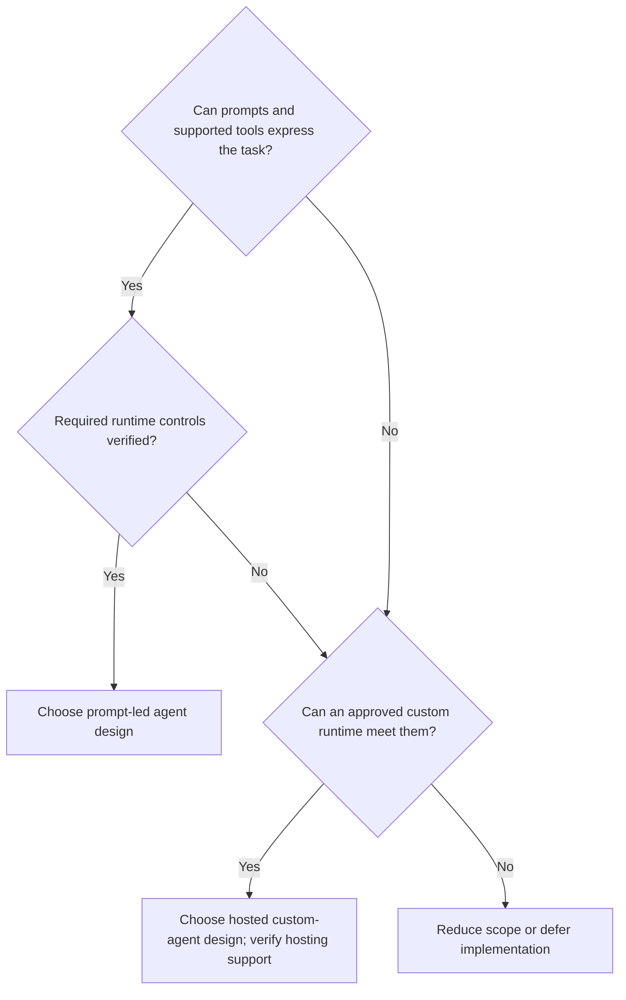

Prompt-led design reduces custom runtime work; hosted design adds code, dependency, and runtime ownership.
**Evidence:** task prototype, tool compatibility, control checklist, and release-owner agreement.
Then apply [hosting selection](#2-foundry-vs-external-hosting); “hosted” is not a statement of current feature availability.
The reviewed [overview](https://learn.microsoft.com/en-us/azure/foundry/agents/overview) has two persisted types—prompt and hosted. Workflow is an orchestration pattern/experience-specific feature, not a third top-level persisted type.
Do not choose new [Foundry visual workflows (Preview)](https://learn.microsoft.com/en-us/azure/foundry/agents/concepts/workflow): retirement is scheduled for **2026-12-01**. Evaluate Microsoft Agent Framework for new workflow orchestration.

## 2. Foundry vs external hosting

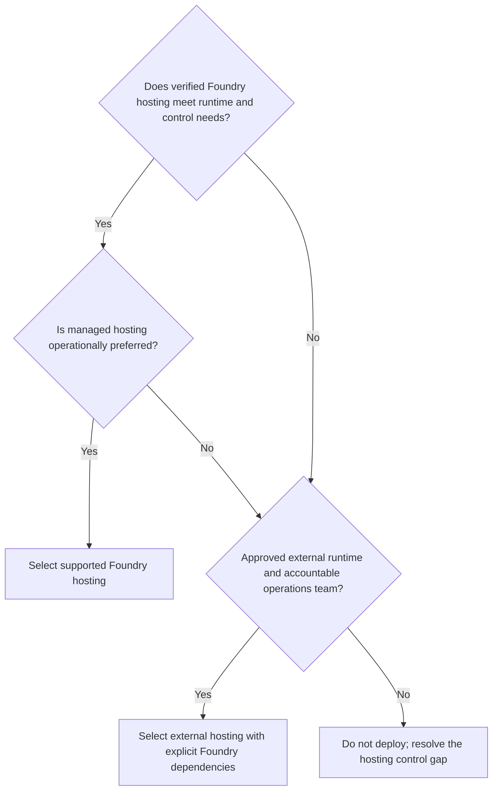

External hosting means the agent runtime is outside Foundry hosting; model or other Foundry services may still be dependencies.
External Responses API code can be an ephemeral agent with no agent resource: register the application/runtime, code version, identities, state, model/tool dependencies, and owner in the [AI inventory](../../docs/25-ai-inventory/README.md).
**Evidence:** runtime/protocol compatibility, identity/egress tests, patching owner, scaling limits, and recovery plan.
Do not infer equivalent isolation or availability from a hosting label.
The [networking options guide](https://learn.microsoft.com/en-us/azure/foundry/agents/concepts/networking-options) covers both prompt and hosted agents; evaluate its runtime-specific matrix, not a blanket hosted/no-private-network assumption.

## 3. Single vs multiple projects

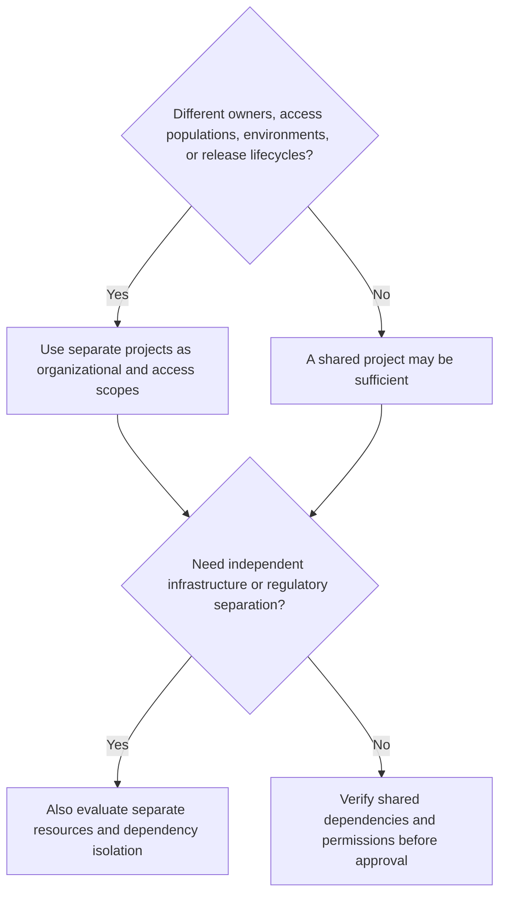

Default production to separate subscriptions and Foundry resources from nonproduction; use projects for workload/access organization within those environment scopes.
Projects are not complete network or security boundaries; a project decision does not resolve regulatory isolation.
**Evidence:** owner/access matrix, environment separation tests, lifecycle ownership, and shared-dependency inventory.

## 4. Single vs multiple Foundry resources

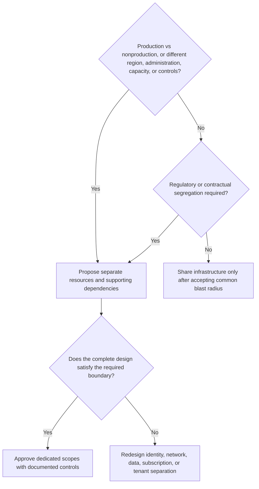

A new resource alone does not guarantee independent quota, networks, keys, administrators, or data processing locations.
**Evidence:** obligation-to-control mapping, current service-limit checks, data flows, cross-scope denial tests, and isolation sign-off.
Compare dedicated infrastructure cost with the risk of [centralized sharing](../reference-architectures/README.md#10-centralized-foundry).

## 5. Central vs federated governance

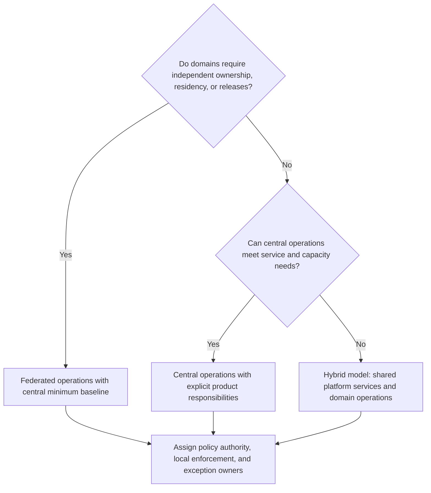

Central governance does not require a single resource; distributed operations do not remove central accountability.
**Evidence:** responsibility matrix, enforceable onboarding/release gates, drift reporting, and exception expiry review.
Use the [federated pattern](../reference-architectures/README.md#11-federated-foundry) when local ownership is a real requirement.

## 6. Direct MCP vs gateway-mediated MCP

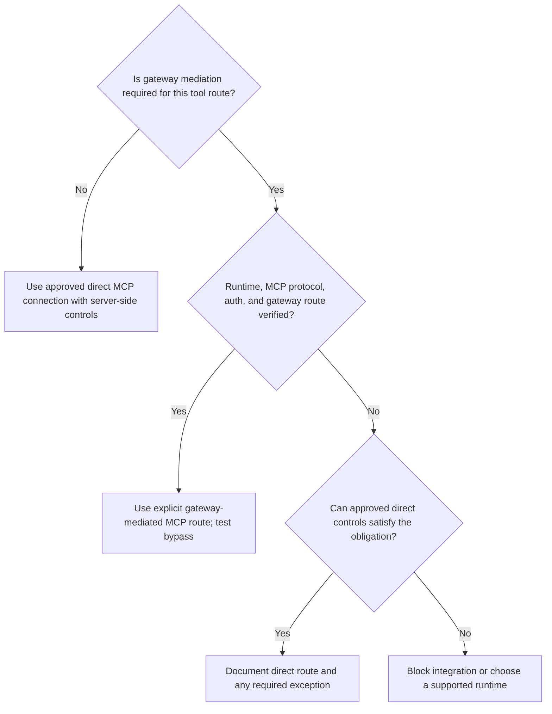

Gateway routing is explicit, not assumed interception of managed agent/tool traffic.
The reviewed [Foundry/APIM integration](https://learn.microsoft.com/en-us/azure/foundry/agents/how-to/tools/governance) is Preview and limited to newly portal-created MCP tools without managed OAuth—not existing, code-first, managed-OAuth, OpenAPI, or native tools.
The MCP server and business API still authorize every operation.
**Evidence:** route trace, streaming/session behavior, caller identity propagation, denial tests, and revocation drill.

## 7. Shared vs private tools

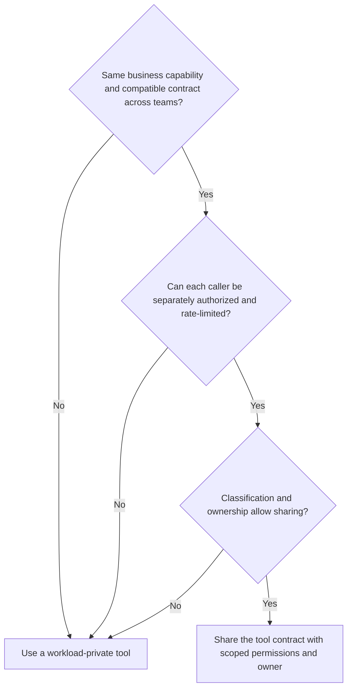

This decision concerns tool capability reuse; it does not decide whether the MCP server, network, or credentials are shared.
**Evidence:** business-object authorization, contract compatibility, owner/on-call assignment, and cross-team deny tests.
A private tool still needs approval, limits, and lifecycle management.

## 8. Shared vs private MCP

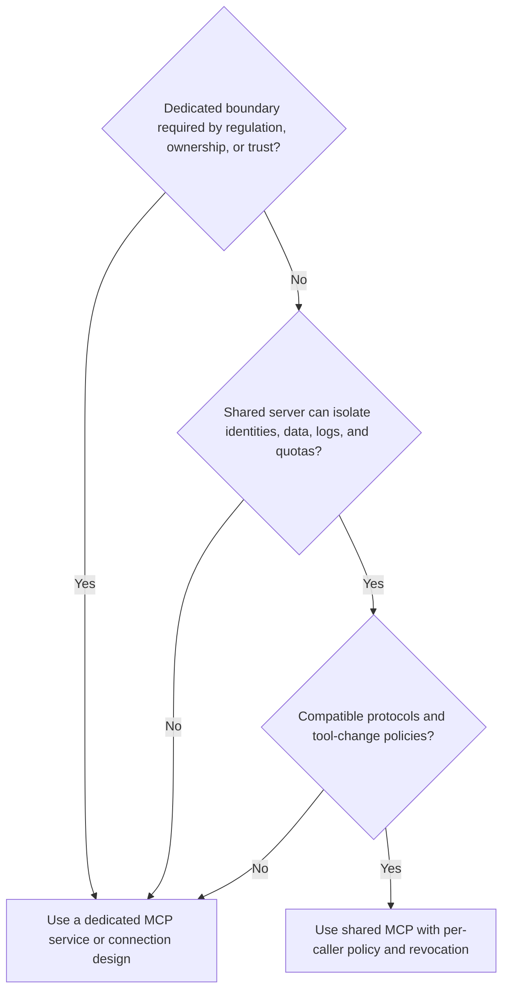

Private means dedicated ownership/access scope here, not a promise of private-network support.
Shared MCP is appropriate only when its authorization and operational isolation are demonstrated.
**Evidence:** tenant-isolation tests, supported authentication/transport, cache separation, and single-consumer revocation.
Managed [Toolboxes](https://learn.microsoft.com/en-us/azure/foundry/agents/concepts/toolbox-overview) are another shared MCP endpoint option; verify version selection, gate default promotion, and review built-in/custom tool schemas and trust independently rather than assuming shared endpoint means shared permissions.
Core Toolboxes are GA in the [named new portal experience](https://learn.microsoft.com/en-us/azure/foundry/concepts/general-availability#feature-readiness-at-ga), not a GA guarantee for every tool, network, protocol, or integration.
Default promotion changes all consumers of that default without redeployment: inventory and regress every affected consumer, and prepare rollback. Preview tool search selects candidates, never permissions.

## 9. PAYG vs PTU

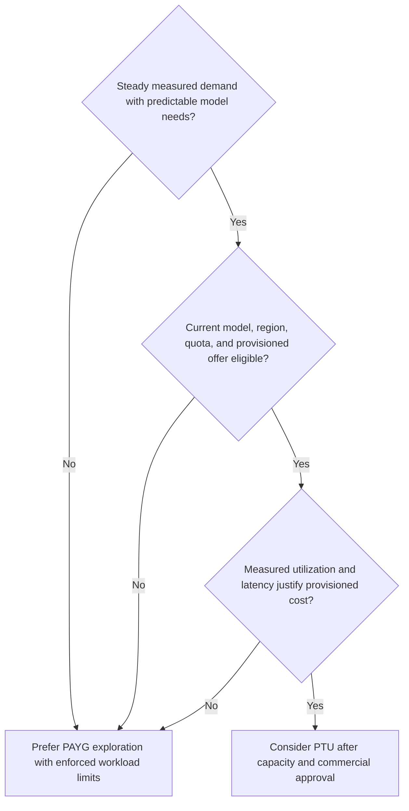

Compare effective cost for successful tasks, not token price alone; include idle provisioned capacity and operational overhead.
PAYG/PTU availability, purchase terms, quota, and spillover behavior require current verification; do not assume automatic fallback.
**Evidence:** demand profile, representative load test, utilization model, approved budget, and quality baseline.

## 10. Application Gateway vs AI Gateway

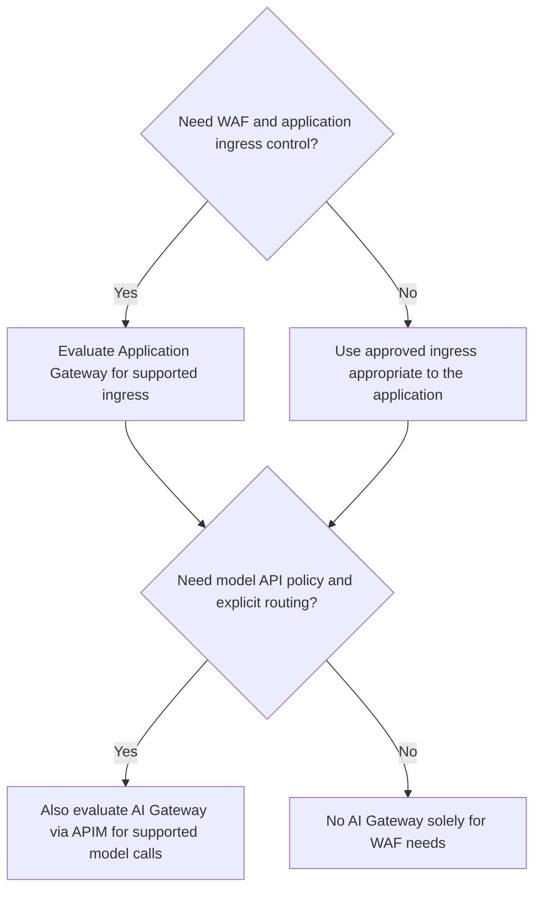

These layers are complementary: WAF/application ingress is not model API governance, and APIM policy is not application authorization.
This tree means traditional APIM policies, not the [Preview dedicated AI Gateway tier](https://learn.microsoft.com/en-us/azure/api-management/ai-gateway-overview), whose reviewed API-key access covers all published models/tools, lacks per-asset authorization, and has no SLA.
Where both are needed, ingress protects the app while an explicitly configured model client uses AI Gateway.
**Evidence:** ingress threat tests, model route trace, backend-access policy, streaming tests, and separate failure handling.
See [Application Gateway overview](https://learn.microsoft.com/en-us/azure/application-gateway/overview) and [AI Gateway capabilities](https://learn.microsoft.com/en-us/azure/api-management/genai-gateway-capabilities).

## 11. Foundry guardrails vs application controls

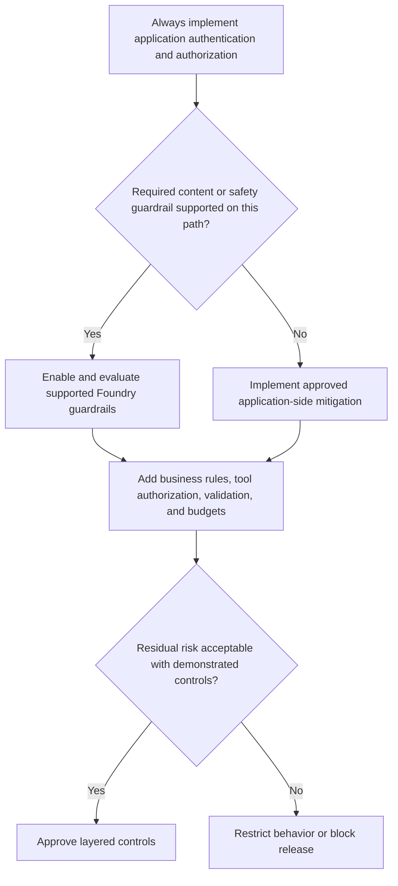

Guardrails are additional defenses, not substitutes for user/object authorization or guarantees against prompt injection.
**Evidence:** adverse-content evaluation, unauthorized-action denial, unsupported-path coverage, and documented residual risk.
Verify guardrail coverage separately for each model, runtime, input/output path, and modality.
The [new-portal readiness matrix](https://learn.microsoft.com/en-us/azure/foundry/concepts/general-availability#feature-readiness-at-ga) marks model guardrails GA and agent guardrails Preview; these scoped statuses do not replace application authorization tests.
An explicit [agent guardrail policy](https://learn.microsoft.com/en-us/azure/foundry/guardrails/guardrails-overview) replaces, rather than merges with, the model policy. Agent annotate-only, Spotlighting, and groundedness controls are unsupported; tool-call/tool-response guardrails are Preview.
For [hosted guardrails](https://learn.microsoft.com/en-us/azure/foundry/agents/how-to/add-hosted-agent-guardrails), omitted configuration provides no hosted content-safety guardrail and an invalid referenced policy can fail open despite active status: require policy-existence and expected-block tests.

## 12. Foundry vs external observability

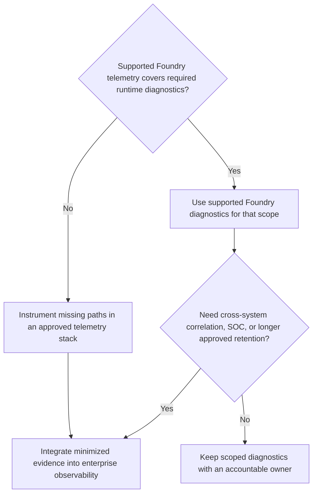

The outcome can use both; native and external views must share a safe correlation strategy without copying all payloads.
**Evidence:** trace completeness, redaction tests, access/retention review, alert delivery, and telemetry-outage behavior.
Never assume every managed agent or tool emits the same traces or supports the same export path.
The [new-portal readiness matrix](https://learn.microsoft.com/en-us/azure/foundry/concepts/general-availability#feature-readiness-at-ga) marks prompt/hosted tracing GA, while external-agent/workflow and VNet tracing are Preview; validate the actual path rather than generalizing the portal's status.
Supported Preview [Control Plane/Operate](https://learn.microsoft.com/en-us/azure/foundry/control-plane/overview) features are an optional, currently portal-only fleet view; reconcile coverage and permissions rather than treating visibility as complete inventory or enforcement evidence.

## 13. Human-in-the-loop vs autonomous

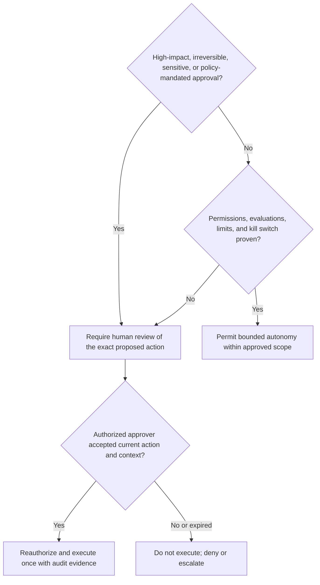

Bind approval to the target, arguments, policy version, expiry, and action identity; changed actions require reapproval.
**Evidence:** approval-tampering test, timeout denial, idempotency test, in-flight containment, and operator drill.
Autonomy is a revocable permission, not an inherent agent capability.

## 14. Single vs multi-agent

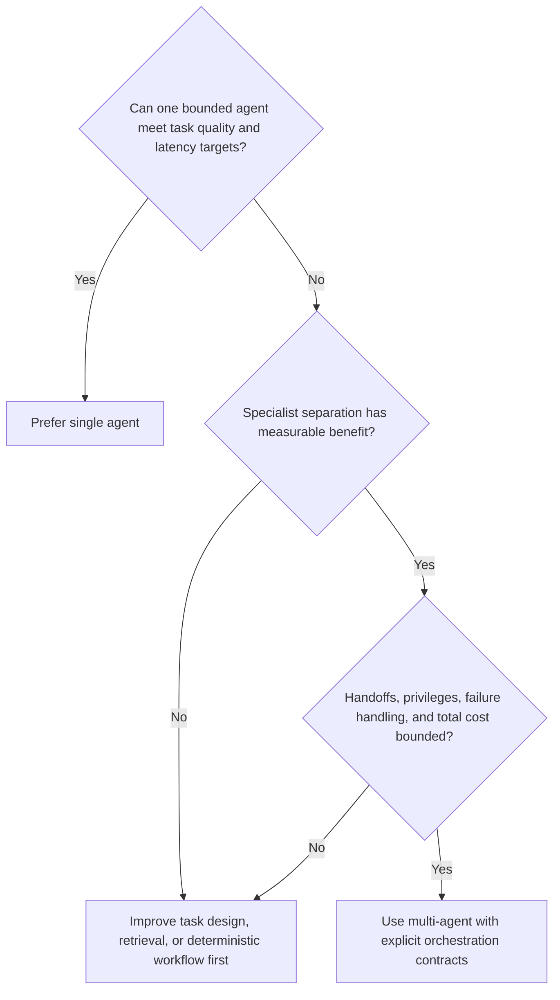

More agents are not automatically more reliable; use deterministic steps where an agent is unnecessary.
**Evidence:** matched single/multi-agent evaluation, end-to-end latency/cost, malicious-handoff tests, and recursion limits.
Compare the [single-agent](../../examples/single-agent/README.md) and [multi-agent](../../examples/multi-agent/README.md) designs.

## Decision record completion

Cross-check resource/project isolation against the chosen governance model; centralized policy and dedicated domain infrastructure can coexist.
Link the selected [reference architecture](../reference-architectures/README.md), companion [governance chapters](../../README.md), accountable owner, and acceptance record.
If a required capability is unverified, record a blocker or approved time-limited exception rather than interpreting an outcome as approval to deploy.
