# Reference architectures

- **Last reviewed:** 2026-09-16
- **Scope:** logical enterprise patterns.
- **Experience:** Foundry resource/project (new), unless stated.
- **Capability status:** feature-specific; Preview/GA only when confirmed in sources; otherwise verification required.
- **Recommendation:** proposed enterprise baseline.
- **Limitations:** diagrams are not network or availability guarantees.
- **Exceptions:** [exception request](../../templates/exception-request.md).

Metadata applies to all 16 patterns and their recommendations unless explicitly overridden.
These are **logical governance patterns**, not deployable or validated solutions.
Follow the [legend](../diagrams/README.md) and [selection trees](../decision-trees/README.md).
No arrow asserts supported runtime interception, networking, replication, or automatic enforcement.
Project boundaries provide organizational and access scoping, not complete security or network isolation.

## Verification contract

Before implementation, check the [Foundry source register](../../references/microsoft-foundry.md) and [Azure source register](../../references/azure.md).
Record current documentation, retrieval date, Foundry experience, resource type, region, runtime, model, protocol, authentication, limits, and feature status.
Also record which principal owns each resource and can modify each enforcement point.
Primary starting points: [Foundry overview](https://learn.microsoft.com/en-us/azure/foundry/), [Agent Service overview](https://learn.microsoft.com/en-us/azure/foundry/agents/overview), and [AI Gateway capabilities](https://learn.microsoft.com/en-us/azure/api-management/genai-gateway-capabilities).
Live Learn retrieval was unavailable; the source registers record primary-source review and remaining uncertainty. Recheck applicability before implementation; no GA status is inferred.
The reviewed overview identifies **prompt** and **hosted** as the two persisted agent types.
External Responses API code can run as an **ephemeral agent** without an agent resource; inventory it as an application/runtime and its dependencies.
“Workflow” below means orchestration or an experience-specific feature, not a third current top-level persisted type.
[Foundry visual workflows (Preview)](https://learn.microsoft.com/en-us/azure/foundry/agents/concepts/workflow) are scheduled to retire on **2026-12-01**. Do not adopt them for new designs; evaluate Microsoft Agent Framework for new workflows and plan migration of existing visual workflows.

### Govern reusable components and proposed changes

[Skills (Preview)](https://learn.microsoft.com/en-us/azure/foundry/agents/how-to/tools/skills) apply to both prompt and hosted agents; follow [skill governance](../../docs/16-skills/README.md), pin a specific immutable skill version, and bind permissions to the consuming runtime, not to instructions in the skill.
[Toolboxes](https://learn.microsoft.com/en-us/azure/foundry/agents/concepts/toolbox-overview) are managed, versioned shared MCP endpoints for built-in/custom tools; core Toolboxes are **GA in the named new portal experience** per the [readiness matrix](https://learn.microsoft.com/en-us/azure/foundry/concepts/general-availability#feature-readiness-at-ga). Review each tool/schema version, network/protocol path, identity, provenance, and response trust individually; core GA does not cover every component.
[Agent optimizer (Limited Preview)](https://learn.microsoft.com/en-us/azure/foundry/agents/concepts/agent-optimizer-overview) can generate candidate instructions, tool descriptions, model selections, and hosted-agent skills within supported scopes.
Verify limited-preview access rather than assuming availability.
Treat those outputs as proposed changes requiring adversarial/quality/cost evaluation, approval, a pinned release, and rollback—not autonomous production updates.
Evaluations may execute tools, mutate external state, and incur real charges; require isolated test endpoints/mocks and separate nonproduction credentials, and approve/redact trace-derived datasets.
Prompt-agent tool-description optimization cannot evaluate actual client-side tool execution; require separate tool/action tests before approving the candidate.

### Gateway scope and verified limitations

“AI Gateway” below means the **traditional APIM policy layer** unless explicitly overridden.
It is not interchangeable with **Foundry/APIM integration (Preview)** or the **dedicated AI Gateway tier (Preview)**.
The reviewed Foundry integration covers only newly portal-created MCP tools without managed OAuth; it does not automatically route existing, code-first, managed-OAuth, OpenAPI, or native tools.
The reviewed dedicated tier has no SLA and its API-key access grants all published models/tools rather than per-asset authorization; do not assume it satisfies the per-product controls in these patterns.
Its networking constraints also differ; neither its controls nor traditional APIM capabilities should be transferred to the other by analogy.
Sources: [Foundry tool governance](https://learn.microsoft.com/en-us/azure/foundry/agents/how-to/tools/governance), [dedicated AI Gateway overview](https://learn.microsoft.com/en-us/azure/api-management/ai-gateway-overview), and the source registers above.
Every runtime route still requires configuration and evidence of the actual path.

## 1. Single-agent application

**Choose when:** one accountable application can answer a bounded task without specialist-agent handoffs.

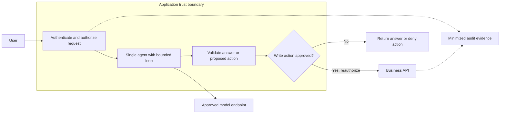

**Identity:** the application validates the user; its scoped workload identity accesses the approved model and permitted API operations.
**Data boundary:** prompts leave the application for an approved model endpoint; business data stays behind API authorization.
**Controls:** bound iterations and payloads, separate answer generation from writes, and authorize every action independently of model output.
**Major failure / limitation:** a single compromised context can influence the whole task; instruction adherence is not authorization.
**Acceptance evidence:** denied cross-user read, denied unapproved write, loop timeout, trace correlation, and a successful disable-action drill.
**Design continuation:** [single-agent worked example](../../examples/single-agent/README.md), [agent architecture](../../docs/06-agent-architecture/README.md), and [identity/access](../../docs/03-identity-access/README.md).

## 2. Enterprise prompt agent

**Choose when:** behavior can be expressed primarily through governed prompts and supported tools, with less custom runtime ownership.

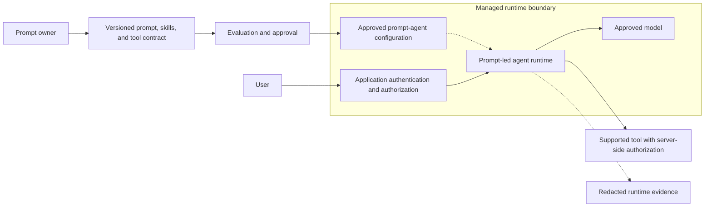

**Identity:** distinguish prompt publishers, runtime identities, and end-user permissions; publishing access does not grant business-data access.
**Data boundary:** approved prompt content and runtime context enter a managed service; each tool remains a separate authorization boundary.
**Controls:** review prompt, skill, and tool changes together, pin an approved release record, and preserve an application-level authorization check. Optimizer-generated candidates pass the same evaluation and approval gates.
**Major failure / limitation:** a managed runtime may not support a required protocol, connection identity, network control, or gateway path.
**Acceptance evidence:** prompt-version evaluation, permission-denial tests, supported-tool verification, and restoration of the previous approved configuration.
**Design continuation:** [Prompt vs Hosted tree](../decision-trees/README.md#1-prompt-vs-hosted-agent), [skills](../../docs/16-skills/README.md), and [change management](../../docs/21-change-management/README.md).

## 3. Hosted agent

**Choose when:** custom orchestration, dependencies, or runtime behavior justify owning the agent code and its supply chain.

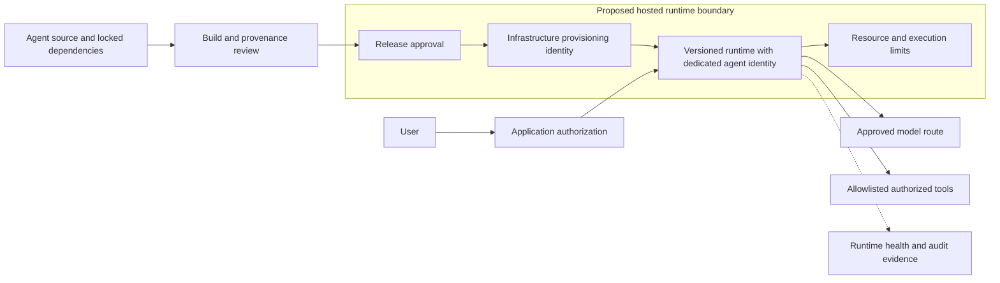

**Identity:** separate build, deployment, and runtime principals. [Hosted execution](https://learn.microsoft.com/en-us/azure/foundry/agents/concepts/hosted-agents) uses its dedicated agent identity; project managed identity serves infrastructure access such as an approved image registry, not implicit business-tool permissions.
**Data boundary:** code and dependencies cross a software-supply-chain boundary; prompts and results cross separately approved service boundaries. Review session files, conversation persistence, and external state stores as distinct data lifecycles.
**Controls:** approve container provenance or the image built from a submitted `.zip`, review bundled skills, restrict egress, bound execution, and retain a previous compatible release.
**Major failure / limitation:** hosted-agent availability, supported execution options, network behavior, and protocols must be checked for the target region and resource type.
The current [networking guide](https://learn.microsoft.com/en-us/azure/foundry/agents/concepts/networking-options) covers both prompt and hosted agents; do not assume hosted agents categorically lack private-network options.
The reviewed hosted guidance describes per-session VM isolation and `$HOME/files` persistence while idle; conversations persist separately, and a state store has its own lifecycle. Idle/session handling is not proof that every copy was deleted.
Reviewed protocols include Responses, Invocations, and WebSocket; A2A v1.0 is explicitly GA and v0.3 Preview in the protocol guidance. These narrow statuses do **not** establish a blanket hosted-agent GA designation; verify the selected protocol/region combination.
[Hosted agent guardrails (Preview)](https://learn.microsoft.com/en-us/azure/foundry/agents/how-to/add-hosted-agent-guardrails) require explicit attachment: omitted configuration provides no hosted content-safety guardrail, and an invalid referenced policy can fail open despite active agent status. Confirm the intended policy exists and blocks expected test cases.
**Acceptance evidence:** dependency review, infrastructure/runtime identity-denial tests, guardrail policy-existence and expected-block tests, unauthorized-egress denial, separate state-retention/deletion checks, timeout behavior, and rollback rehearsal.
**Design continuation:** [hosting choice](../decision-trees/README.md#2-foundry-vs-external-hosting), [network security](../../docs/04-network-security/README.md), and [CI/CD](../../docs/20-cicd/README.md); external hosting is a separate operational choice.

## 4. Multi-agent

**Choose when:** evaluated specialist separation improves quality enough to justify additional coordination, latency, and attack surface.

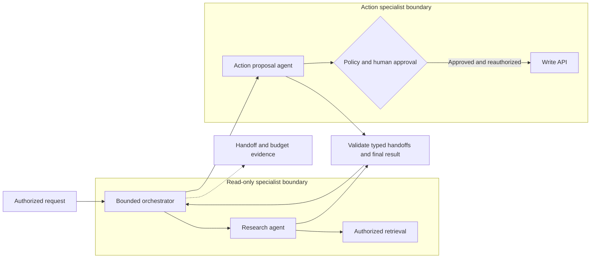

**Identity:** specialists use distinct scopes where supported; an agent handoff never transfers broader user or workload permissions implicitly.
**Data boundary:** handoffs carry minimized, typed task context; retrieval text and peer-agent output are untrusted input.
**Controls:** cap recursion, handoffs, token spend, and tool calls; bind approvals to exact actions.
**Major failure / limitation:** delegation can amplify prompt injection, loop indefinitely, or create a confused deputy with excessive permissions.
**Acceptance evidence:** malicious handoff rejection, denied privilege escalation, bounded-loop test, comparative quality result, and orchestration rollback.
**Design continuation:** [multi-agent worked example](../../examples/multi-agent/README.md), [agent security](../../docs/07-agent-security/README.md), and [human approval](../../docs/23-human-in-the-loop/README.md).

## 5. RAG

**Choose when:** answers require current enterprise knowledge with source attribution and permission-aware retrieval.

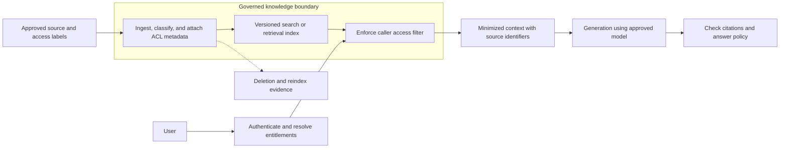

**Identity:** ingestion and query identities are separate; retrieval enforces the caller's current access, not merely index access by a shared service identity.
**Data boundary:** derived chunks, embeddings, caches, and citations inherit source classification and retention requirements.
**Controls:** test ACL filtering before generation; synchronize access changes and deletions; treat retrieved instructions as hostile content.
**Major failure / limitation:** stale access metadata or cached answers can disclose revoked documents even when retrieval initially passed.
**Acceptance evidence:** cross-role deny test, revocation/deletion propagation timing, citation accuracy, and fallback when retrieval fails.
**Design continuation:** [RAG worked example](../../examples/rag/README.md), [data governance](../../docs/05-data-governance/README.md), and [quality evaluation](../../docs/12-quality-evaluation/README.md).

## 6. Agent + MCP

**Choose when:** an agent needs an explicitly approved MCP integration and the chosen runtime supports its required transport and authentication.

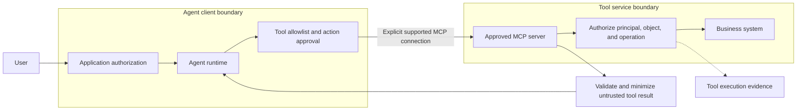

**Identity:** document whether the MCP flow uses a workload or delegated user identity; do not assume user identity passes through every hop.
**Data boundary:** server discovery, tool descriptions, arguments, and responses cross an untrusted integration boundary.
**Controls:** register approved servers and tools, validate arguments, constrain returned data, and enforce business authorization at the server/API.
**Major failure / limitation:** runtime support varies by transport, authentication, server type, and region; tool output can inject instructions.
**Acceptance evidence:** unauthorized tool denial, argument-tampering test, supported connection trace, and removal of the MCP connection.
**Design continuation:** [MCP worked example](../../examples/mcp/README.md), [MCP governance](../../docs/09-mcp/README.md), and [tool controls](../../docs/08-tools/README.md).

## 7. Agent + AI Gateway

**Choose when:** a caller can explicitly route supported model requests through a governed gateway policy layer.

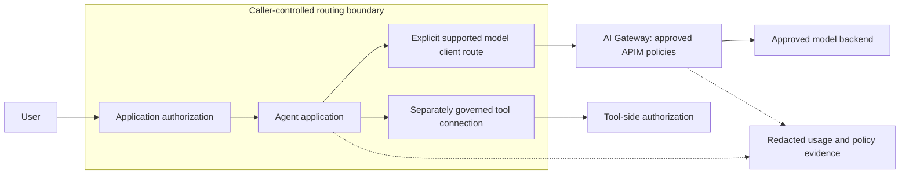

**Identity:** authenticate callers to the gateway and scope gateway-to-backend access separately; subscription keys alone are not user authorization.
**Data boundary:** model payloads cross the gateway and backend boundaries; tool traffic follows its independently documented route.
**Controls:** restrict backend access to intended callers where feasible; apply verified policies for the actual API and streaming mode.
**Major failure / limitation:** managed model or tool paths may not support APIM interception; do not draw them through a gateway without proof.
**Acceptance evidence:** positive route trace, direct-backend denial where required, streaming/error tests, and gateway outage behavior.
**Design continuation:** [AI Gateway worked example](../../examples/ai-gateway/README.md) and [AI Gateway governance](../../docs/10-ai-gateway/README.md).

## 8. Enterprise AI Gateway

**Choose when:** multiple products need consistent, explicitly routed model-consumption policy and accountable usage allocation.

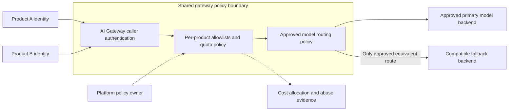

**Identity:** bind trusted product identity to quota and accounting; never trust a caller-supplied cost-center header without validation.
**Data boundary:** a shared gateway processes multiple products' payloads; logging, caching, and administration must prevent cross-product disclosure.
**Controls:** isolate credentials and policy changes, disable unsafe shared caches, and approve model fallback against residency and quality requirements.
**Major failure / limitation:** a shared gateway expands blast radius; retry storms, quota contention, or incompatible fallback can affect many products.
**Acceptance evidence:** noisy-neighbor load test, allocation reconciliation, fallback quality test, administrative access review, and policy rollback.
**Design continuation:** [centralized vs federated selection](../decision-trees/README.md#5-central-vs-federated-governance), [model governance](../../docs/11-model-governance/README.md), and [consumption controls](../../docs/18-consumption/README.md).

## 9. Shared MCP platform

**Choose when:** several teams need governed tool reuse and the tool platform can enforce per-caller entitlements.

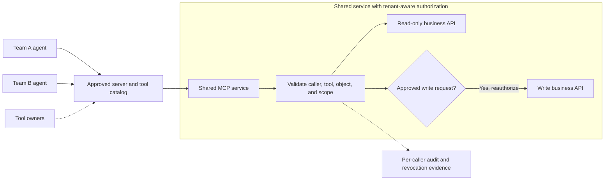

**Identity:** preserve trustworthy caller context or use separate narrowly scoped connections; shared infrastructure does not imply shared privileges.
**Data boundary:** each server and downstream system must separate tenants, business domains, logs, caches, and tool responses.
**Controls:** version tool contracts, approve onboarding, rate-limit callers, and revoke one connection without disrupting unrelated consumers.
When using a managed [Toolbox](https://learn.microsoft.com/en-us/azure/foundry/agents/concepts/toolbox-overview), pin the approved endpoint/tool-schema version and evaluate built-in/custom tool provenance, descriptions, permissions, and response trust separately.
Verify consumer version-selection behavior: promoting a shared default updates all consumers of that default without their own deployment. Inventory every affected consumer; require compatibility/regression evaluation, approval, and shared-version rollback.
[Tool search (Preview)](https://learn.microsoft.com/en-us/azure/foundry/agents/how-to/tools/tool-search) returns candidate selections, not permission grants; authorize each discovered tool invocation and test denied-tool discovery/use.
**Major failure / limitation:** MCP availability does not itself provide catalog governance, tenant authorization, or supported gateway mediation.
**Acceptance evidence:** cross-team deny tests, tool-version compatibility, single-caller revocation, load isolation, and ownership attestation.
**Design continuation:** [shared/private MCP tree](../decision-trees/README.md#8-shared-vs-private-mcp), [sharing](../../docs/17-sharing/README.md), and [MCP governance](../../docs/09-mcp/README.md).

## 10. Centralized Foundry

**Choose when:** central operations and shared service standards outweigh the need for independently owned infrastructure.

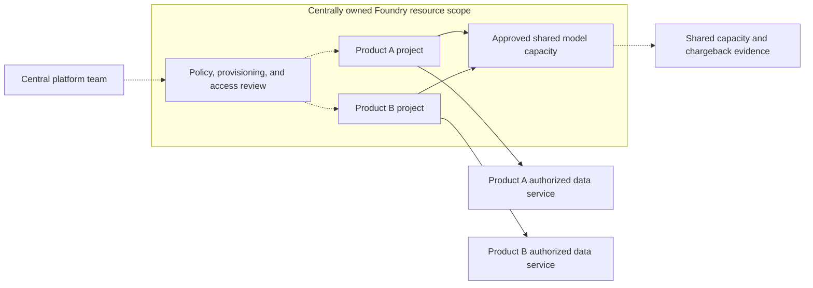

**Identity:** central administrators manage infrastructure; product identities retain narrow project and data-service permissions.
**Data boundary:** project boundaries organize access but do not prove independent networks, quota, keys, administration, or regulatory isolation.
**Controls:** document inherited controls, project onboarding, shared-capacity quotas, and central change approval. Default production to separate subscriptions/resources from nonproduction; share product infrastructure only within approved environment scopes.
**Major failure / limitation:** a central administrative error or exhausted shared dependency can affect otherwise separate products.
**Acceptance evidence:** role matrix, cross-project access tests, capacity contention test, per-product cost allocation, and central recovery ownership.
**Design continuation:** choose [new project vs new resource](../decision-trees/README.md#4-single-vs-multiple-foundry-resources) using [resource topology](../../docs/02-resource-topology/README.md) and [governance ownership](../../docs/01-governance-model/README.md).

## 11. Federated Foundry

**Choose when:** business units need separate operations, residency choices, or release autonomy under common standards.

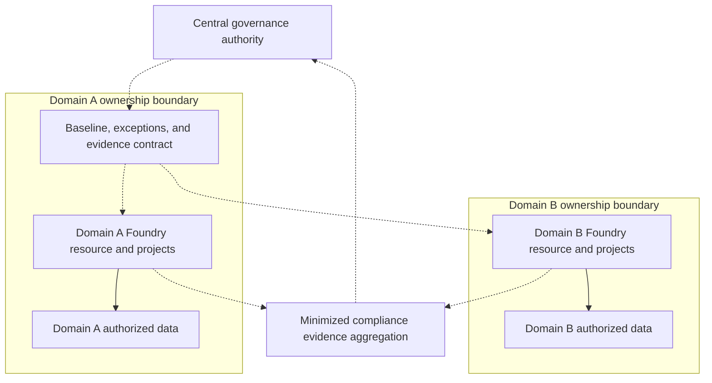

**Identity:** domain teams own scoped deployment and runtime identities; central governance has explicit review rights, not assumed unrestricted data access.
**Data boundary:** operational and data boundaries remain in each domain; only approved evidence crosses into central reporting.
**Controls:** enforce baseline checks in each domain's release process, separate production subscriptions/resources from nonproduction, assign local incident owners, and time-limit centrally recorded exceptions.
**Major failure / limitation:** distributed ownership can cause policy drift and duplicated cost; a baseline document is not technical enforcement.
**Acceptance evidence:** domain attestations, drift reports, exception expiry tests, domain-specific recovery drills, and evidence-access review.
**Design continuation:** [enterprise worked example](../../examples/enterprise/README.md), [governance model](../../docs/01-governance-model/README.md), and [compliance](../../docs/24-compliance/README.md).

## 12. Highly regulated

**Choose when:** regulation or contractual risk requires demonstrable segregation, approved data locations, and constrained change authority.

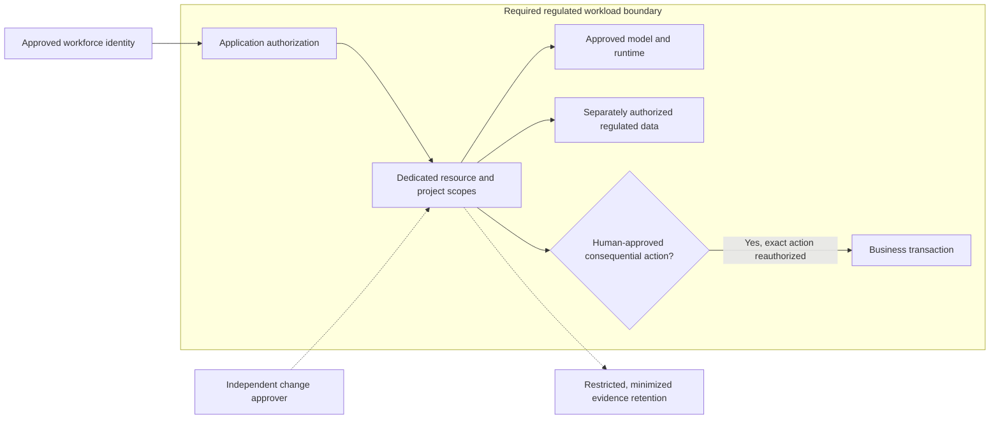

**Identity:** separate administration, approval, runtime, and audit roles; require least privilege and break-glass procedures with independent review.
**Data boundary:** validate networking, encryption/key requirements, data processing locations, retention, and operator access separately.
**Controls:** derive isolation from the actual obligation; create additional resources, subscriptions, or tenants only where justified and supported.
**Major failure / limitation:** a new project or resource alone does not satisfy isolation, certification, residency, or regulatory compliance.
**Acceptance evidence:** obligation-to-control mapping, verified data-flow inventory, segregation tests, access reviews, and restoration/deletion drills.
**Design continuation:** use the [resource separation tree](../decision-trees/README.md#4-single-vs-multiple-foundry-resources), [compliance mapping](../../docs/24-compliance/README.md), and [guardrails](../../docs/15-guardrails/README.md); obtain compliance sign-off.

## 13. Multi-region

**Choose when:** an approved recovery objective or locality requirement justifies duplicated capacity and tested regional operation.

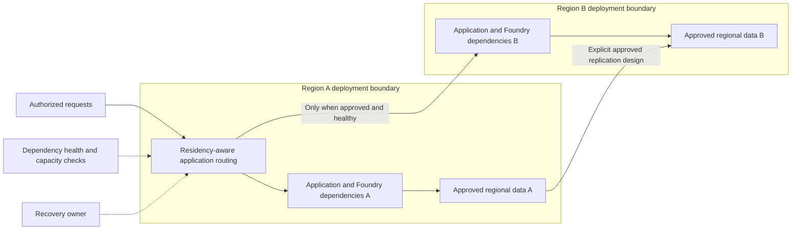

**Identity:** provision and test regional identities, credentials, and emergency access; do not assume failover inherits working authorization.
**Data boundary:** replication, routing, backups, telemetry, and model processing locations all require residency approval.
**Controls:** establish recovery objectives, synchronization behavior, idempotency, regional capability parity, and sufficient secondary capacity.
**Major failure / limitation:** the diagram does not imply automatic Foundry replication, available quota, model parity, or regional failover.
**Acceptance evidence:** dependency inventory, secondary capacity check, observed recovery timings, duplicate-action prevention, and failback drill.
**Design continuation:** use [production operations](../../docs/22-production-operations/README.md) and [data governance](../../docs/05-data-governance/README.md); retain a degraded read-only or unavailable response when compliant failover is impossible.

## 14. Production SOC

**Choose when:** a production workload needs actionable detection, incident ownership, and a tested containment path.

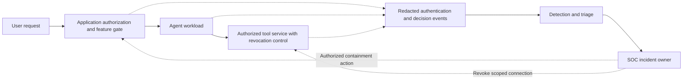

**Identity:** distinguish monitoring readers from incident responders authorized to disable a feature, revoke a connection, or block a caller.
**Data boundary:** telemetry is a sensitive derived dataset; redact payloads, restrict access, and preserve approved evidence integrity.
**Controls:** correlate request, principal, tool, release, and policy decisions; give alerts an owner, severity, and response procedure.
**Major failure / limitation:** logging alone does not stop execution; disabling new requests may leave in-flight writes or external side effects.
**Acceptance evidence:** synthetic alert-to-owner drill, scoped containment timing, in-flight action handling, and evidence retrieval without sensitive prompt exposure.
**Design continuation:** follow [security monitoring](../../docs/14-security-monitoring/README.md) and [observability](../../docs/13-observability/README.md); layer detection over authorization, not instead of preventive controls.
**Optional implementation:** supported Preview [Control Plane/Operate](https://learn.microsoft.com/en-us/azure/foundry/control-plane/overview) features provide subscription-scoped fleet views of agents/models/tools through a currently portal-only experience. Verify external-agent coverage, access, and Defender/Purview/Entra integrations; reconcile inventory and redacted signals while retaining application tests and owner-held evidence.

## 15. Production FinOps

**Choose when:** production spend must be attributable, bounded, and evaluated alongside quality and user impact.

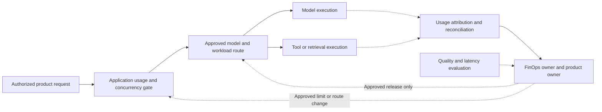

**Identity:** bind usage to validated workload identity and approved allocation dimensions; do not include personal data in accounting labels.
**Data boundary:** retain aggregated usage where possible; restrict detailed traces that could expose user behavior or proprietary content.
**Controls:** combine application-enforced limits with verified service policies; compare model, retrieval, tool, gateway, and logging costs.
**Major failure / limitation:** budget alerts and delayed usage records are not immediate hard stops; cheapest-model routing can reduce task quality.
**Acceptance evidence:** allocation reconciliation, limit exhaustion test, quality/cost comparison, anomaly response drill, and verified capacity-commercial assumptions.
**Design continuation:** [PAYG vs PTU tree](../decision-trees/README.md#9-payg-vs-ptu), [FinOps](../../docs/19-finops/README.md), and [consumption](../../docs/18-consumption/README.md) require measured demand and current offering verification.

## 16. Full enterprise AI platform

**Choose when:** several production domains need shared standards and reusable services without erasing workload-specific trust boundaries.

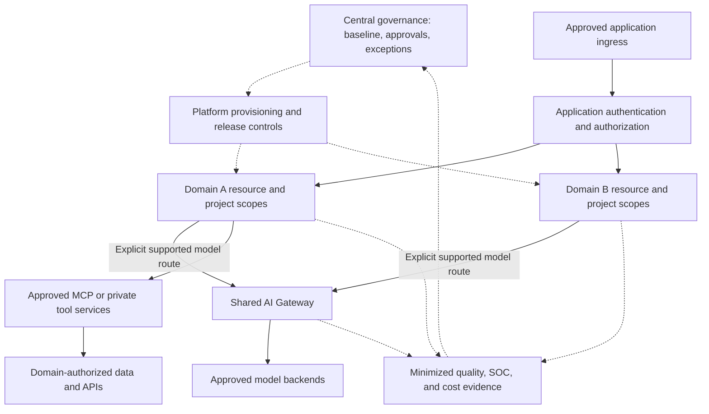

**Identity:** central policy, domain operations, application users, gateway callers, and tool execution each have explicit identity and authorization responsibilities.
**Data boundary:** choose shared or dedicated services per classification, jurisdiction, tenant, and blast radius; require separate review of every cross-domain flow.
**Controls:** combine release gates, evaluations, retrieval ACLs, tool approval, explicit gateway routes, incident response, and usage ownership.
**Major failure / limitation:** no single Foundry resource, gateway, or management team guarantees end-to-end governance; managed runtime paths may bypass an optional gateway route.
**Acceptance evidence:** end-to-end threat and data-flow review, policy-denial tests, quality gates, cost reconciliation, recovery/containment drills, and accountable exception records.
**Design continuation:** [enterprise worked example](../../examples/enterprise/README.md), [AI inventory](../../docs/25-ai-inventory/README.md), [maturity](../../docs/26-maturity-model/README.md), and the [repository chapter index](../../README.md).
A fleet view, including the optional [Control Plane/Operate integration](#14-production-soc), is neither complete automatic discovery nor proof that every control is enforced.

## Review handoff

For any selected pattern, attach the decision-tree outcome, current capability checks, implementation owner, residual risks, and acceptance evidence.
Mark unverified controls as blockers or approved time-limited exceptions, not as implemented guarantees.
Re-review when the model, runtime, tools, hosting, routing, data classification, region, or organizational ownership changes.
