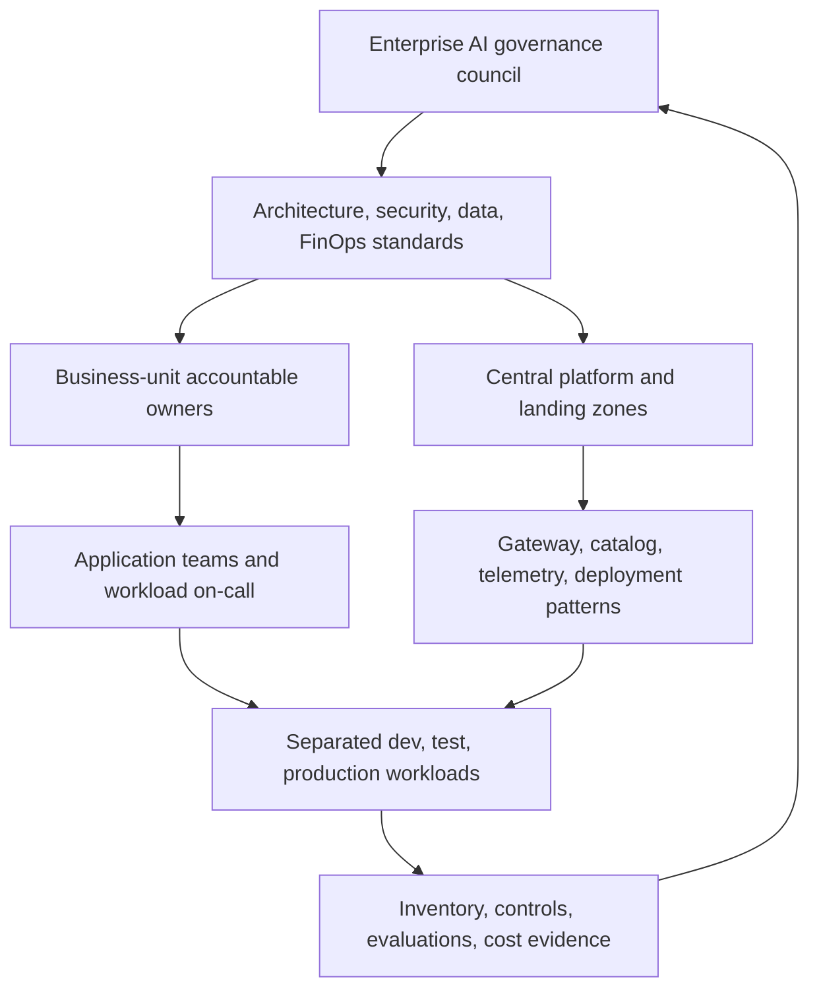

# Governance operating model

Last reviewed: **2026-09-16**. Scope: enterprise platform, application teams, shared components, and all environments. Experience: Foundry resource/project, with explicit legacy exceptions. Capability status: Azure/Foundry feature-specific; see [sources](../../references/microsoft-foundry.md). Recommendation: federated delivery with central minimum controls. Limitations: an organizational role is not an Azure RBAC role. Exceptions: [request form](../../templates/exception-request.md). Metadata applies to all recommendations below.

## Microsoft capability

Azure management groups, subscriptions, resource groups, RBAC, policy, and Foundry resources/projects offer management scopes. They do not appoint business owners, approve risk, or enforce every application-level control. See [identity](../03-identity-access/README.md) for technical permissions and [topology](../02-resource-topology/README.md) for actual boundaries.

## Enterprise recommendation: federated by default

The central platform team operates landing zones, supported deployment patterns, shared gateway/tool infrastructure, baseline identity/network controls, common telemetry, and capacity onboarding. Business-aligned teams own use cases, code, prompts, evaluations, application data access, on-call response, and outcomes. Security, data, FinOps, and AI governance retain approval authority in their domains.

Centralization is a service model, not a requirement to put every workload in one Foundry resource. Highly restricted or independently regulated units may operate separate platforms under the same minimum standards.

## Personas and responsibilities

| Persona | Accountable for / responsibilities | Not delegated away |
| --- | --- | --- |
| Business owner | Business purpose, impact/risk appetite, funding, customer outcome | High-impact business-action acceptance |
| Platform owner | Landing zone, subscription vending, resource provisioning, shared identity/network/gateway/monitoring services | Platform SLOs, support, upgrade and decommission plans |
| Workload owner | Agent/application design, implementation, release, dependencies, evaluations, production operation | End-to-end outcome even when dependencies are shared |
| Security owner / SOC | Threat model standards, identity/network/agent-security review, detection and response | Security exceptions and containment authority |
| Data owner / steward | Permitted purpose, classification, access, residency, retention, lineage | Approval of sensitive data use and disclosure |
| FinOps owner | Allocation rules, showback/chargeback, forecasts, capacity and optimization guidance | Budget governance; business owner accepts spend |
| AI governance owner | Risk tier, evaluation/Responsible AI standards, inventory coverage, oversight and periodic review | AI risk approval and residual-risk tracking |
| Compliance / privacy owner | Applicable obligations, records, privacy assessment, audit mapping | Legal interpretation and regulatory sign-off |
| Release authority | Independent production release decision over evidence and exceptions | No self-approval of high-risk changes |
| Operations owner / incident commander | SLO monitoring, runbooks, escalation, recovery and drills | Timely containment and validated restoration |
| Tool / MCP / model / skill owner | Contract, approved version, permissions, provenance, service SLO, lifecycle, cost | Communicating breaking changes to registered consumers |

One person may hold multiple roles in a small organization; preserve independent approval where separation of duties is mandatory.

## RACI

**R** performs the work; **A** is the single accountable role for that row; **C** is consulted; **I** is informed. “Workload” includes the application team; component owners act as workload owners for shared services. Domain approvals have separate rows so a business sponsor cannot override a security/data obligation.

| Activity | Business | Platform | Workload | Security | Data | FinOps | AI gov | Compliance | Release | Ops |
| --- | --- | --- | --- | --- | --- | --- | --- | --- | --- | --- |
| Use-case purpose and funding | A | I | R | C | C | C | C | C | I | I |
| Landing zone and shared platform | I | A/R | C | C | C | C | C | I | I | R |
| Workload architecture and inventory | C | C | A/R | C | C | C | C | C | I | C |
| Security approval and security exceptions | I | R | R | A | C | I | C | C | I | C |
| Data access/residency/retention approval | C | R | R | C | A | I | C | C | I | I |
| AI risk and evaluation standard approval | C | C | R | C | C | I | A | C | I | C |
| Model/tool/MCP/skill onboarding | I | C | A/R | C | C | C | C | C | I | C |
| Quality execution and regression evidence | C | C | A/R | C | C | C | C | I | I | R |
| Cost allocation and capacity reporting | C | R | R | I | I | A | I | I | I | C |
| Business-risk acceptance for launch | A | C | R | C | C | C | C | C | C | C |
| Production release authorization | C | C | R | C | C | C | C | C | A | R |
| Incident containment and recovery | I | R | R | R | C | C | I | C | I | A |
| Compliance applicability and audit | C | R | R | C | C | C | C | A | I | C |
| Fleet governance review | C | R | R | C | C | C | A | C | I | C |
| Workload retirement | C | R | A | C | C | C | C | C | I | R |

## Policy

- Every production agent, model deployment, tool, MCP server, skill, gateway/API, and data dependency must have a stable inventory ID, named accountable owner, support contact, risk/data classification, environment, region, lifecycle state, and cost center.
- No ownerless shared service, production resource, or expired exception may pass a new release gate.
- Security, data, and compliance approval cannot be substituted by budget approval or a general governance-board approval.
- Environment and business-unit delegation must stay within approved landing-zone and resource boundaries. Subscription Owner is not the default developer role.
- The workload on-call and security incident commander must have a tested, auditable path to disable agent ingress, revoke tool access, and stop queued execution. Platform on-call owns shared gateway/model route containment. Emergency containment does **not** wait for a normal release board.

## Implementation

### Platform onboarding and review

1. Business owner submits purpose, criticality, risk class, target regions, data categories, expected scale, and funding.
2. Architecture selects topology and identifies central services versus workload-specific infrastructure. Platform vends nonproduction first through approved IaC.
3. Domain reviewers approve identity/data flows, tools/models/MCP, network boundaries, risk controls, quality/cost thresholds, and preview dependencies.
4. Application team registers immutable dependencies, evidence links, operators, escalation, kill switch, and retirement plan.
5. Release authority reviews architecture, security, production readiness, and go-live checklists against the same release manifest.
6. Operations reviews SLO/quality/safety signals continuously; workload and FinOps review cost monthly. Governance reviews fleet ownership, access, exceptions, service status, and maturity quarterly.

### Exception management

Use the [exception template](../../templates/exception-request.md). Record control IDs, precise asset/environment scope, business justification, alternatives rejected, residual risk, compensating controls, evidence, approvers, expiry, and exit plan. Default recommended maximum duration is **90 days**, shorter for preview/high-risk access; the relevant risk owner may require a shorter period. This is an enterprise default, not a Microsoft limit.

An independent domain owner approves the relevant risk; business owner accepts business impact. Compliance obligations that cannot legally be waived are not exceptions. Reapproval is explicit, never automatic. At expiry block new affected deployments and execute the documented restriction/containment plan; do not silently keep a waiver active.

### Retirement

The workload owner identifies dependent consumers; agrees a migration or shutdown date; disables endpoints, schedules, and tool/MCP grants; cancels dedicated capacity where appropriate; revokes identities/secrets; handles data/backups under retention and legal hold; verifies absence of traffic and spend; and archives release/audit evidence. Shared owners verify that surviving consumers are not broken. See [inventory lifecycle](../25-ai-inventory/README.md).

## Enterprise governance checklist

- [ ] Sponsor has ratified the baseline and appointed domain policy owners.
- [ ] Platform service boundaries, funding, SLOs, and escalation are published.
- [ ] Each workload and shared component has one accountable owner and inventory record.
- [ ] Topology separates environments and incompatible risk/data boundaries.
- [ ] Persona permissions, approval separation, and emergency operators are tested.
- [ ] Risk, data, security, quality, cost, and compliance approvals are linked to releases.
- [ ] Exceptions have independent approvers, expiry, compensating controls, and exit plans.
- [ ] Fleet review measures missing owners, stale evidence, expired exceptions, and unsupported dependencies.
- [ ] Retirement revokes access and spend without violating retention or breaking consumers.

## Evidence

Retain the signed RACI/service ownership map, approved topology, inventory export, domain approvals, exception register, release manifests, access review, governance meeting decisions, containment exercise, and retirement attestations. Track coverage as compliant in-scope assets / all in-scope assets; do not count an unregistered asset as out of scope.

## Sources and limitations

- [Azure landing zones](https://learn.microsoft.com/en-us/azure/cloud-adoption-framework/ready/landing-zone/).
- [Azure RBAC overview](https://learn.microsoft.com/en-us/azure/role-based-access-control/overview).
- [Foundry documentation and status caveats](../../references/microsoft-foundry.md).

Azure RBAC enforcement and organizational RACI are complementary, not interchangeable. The adopting enterprise must supply names, staffing, escalation contacts, and actual decision records.
