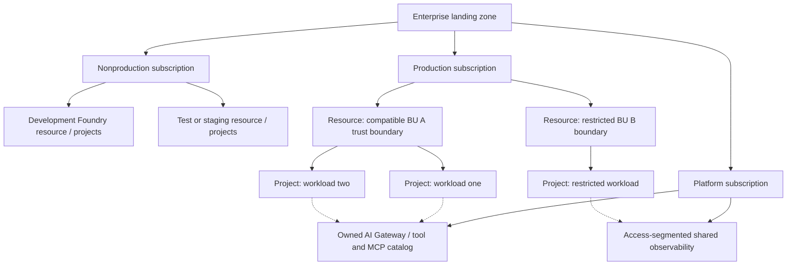

# Foundry resource and project topology

Last reviewed: **2026-09-16**. Scope: enterprise subscriptions, resources, projects, shared services, and disaster recovery. Experience: Foundry resource/project; assess hub-based workloads separately. Capability status: feature-specific, **Verification required** for exact sharing, network, region, and runtime combinations; see [register](../../references/microsoft-foundry.md). Recommendation: federated ownership with risk-aligned isolation. Limitations: project separation is not proof of independent network/capacity/storage boundaries. Exceptions: [request](../../templates/exception-request.md). Metadata applies throughout.

## Microsoft capability

Azure provides hierarchical management and authorization scopes. Foundry resource/project relationships, dependent storage/search/database services, model deployments, and agent runtime configurations introduce additional scopes. Their boundaries differ: a permission scope, billing scope, network boundary, model quota, and data-processing geography need not coincide.

Do not infer capabilities from the portal label alone. Existing classic experiences may involve different project types; record the actual Azure resource types and API versions in implementation evidence.

## Enterprise recommendation: default topology

| Layer | Recommended default | Create a separate boundary when |
| --- | --- | --- |
| Management group / landing zone | Enterprise policies with governed exceptions | Different regulatory/control inheritance is required |
| Subscription | Dedicated production subscription(s); nonproduction separate; platform shared services separately owned | Legal/billing ownership, administrative delegation, policy, quota strategy, or blast radius differs |
| Resource group | Application/platform component and environment lifecycle grouping | Independent deployment, access administration, or retirement lifecycle |
| Foundry resource | Per environment and compatible trust/residency/operating boundary | Resource-level controls, identity, shared dependencies, owner, or capacity/network requirements cannot safely be shared |
| Project | Per workload/product team within a compatible resource boundary | Separate application lifecycle, access delegation, inventory, or evaluation assets |
| Model deployment | Approved model/version/deployment type with explicit consumers | Quality, quota/capacity, throughput predictability, billing, or isolation needs differ |
| Storage/search/state | Separate by classification, tenant authorization, retention, lifecycle | Access/residency/key/retention requirements conflict or isolation cannot be proven |
| Gateway and MCP platform | Shared by compatible consumers, with per-consumer authorization, quotas and service ownership | Shared privilege, data, availability, protocol, or operational risk is unacceptable |
| Observability | Common metadata schema, access-segmented workspaces/storage | Sensitive content, retention, region, or operator access differs |

Separate subscriptions or Foundry resources do **not automatically** produce independent model quota or regional capacity. Check the service's actual quota dimensions and obtain capacity before choosing a topology for throughput.

The [Foundry planning guide](https://learn.microsoft.com/en-us/azure/foundry/concepts/planning) describes capability-dependent project isolation, not a universal project sandbox. Its matrix distinguishes agent-centric APIs from operations requiring parent-resource access; parent connections and some model-related operations can be shared. Inspect the matrix for the actual capability mix before sharing a resource.

The **Preview Foundry–APIM association workflow** is narrower than the general central-gateway architecture: its [setup guide](https://learn.microsoft.com/en-us/azure/foundry/configuration/enable-ai-api-management-gateway-portal) specifies same-subscription/tenant v2 APIM and one associated gateway per Foundry resource. A gateway in a separate platform subscription therefore requires an independently supported, explicitly configured routing design—not an assumption that this association workflow supports it. Separate gateways per project can require separate Foundry resources.

Dotted lines represent permitted integration only after network, identity, data, and service support are verified. Restricted workloads may require separate gateway and telemetry infrastructure.

## Decision rules

Use the [decision trees](../../architecture/decision-trees/README.md) for visual selection. These rules supply the rationale.

### When should we create a new Foundry resource?

1. Different production/nonproduction trust boundary? **Separate resources by default**, usually subscriptions too.
2. Different residency, administrative owner, network restrictions, encryption/dependency requirements, or unacceptable shared blast radius? **Separate resource**, and other scopes as required.
3. Compatible controls but separate app teams/lifecycles? Prefer **separate projects** after verifying the feature's permission and sharing model.
4. Throughput reason alone? First verify quota/capacity accounting; more resources may not add quota.

### When should we create a new project?

Use a new project for an independently owned workload or separately administered lifecycle **within compatible parent controls**. A new agent version, experiment, or prompt does not inherently require a new project. Use separate projects for delegated teams only after a negative-access test demonstrates intended isolation; escalate to a separate resource/subscription if parent permissions or dependencies violate the requirement.

### When should projects share infrastructure?

Share only if **all** are true: compatible data classification/residency; enforceable per-consumer identity and authorization; owned versioned contract; tenant-aware telemetry/cost attribution; tested quotas/noisy-neighbor controls; agreed SLO; safe upgrade/retirement. Never share a broad privileged credential merely because projects are within one resource.

### When should workloads be isolated?

Isolate high-impact write agents from low-risk assistants, regulated data from unrestricted experimentation, incompatible tenant/data boundaries, untrusted external MCP/tools from internal services, and workloads whose outage or compromise cannot be tolerated together. Isolation is a combination of identity, data authorization, network, runtime, and operations—not simply naming resources differently.

### Central versus distributed governance

Start with **central minimum policy and federated workload ownership**. Centralize infrastructure where contracts and isolation are enforceable and scale/support justify it. Distribute resource administration where business-unit autonomy, legal separation, residency, or independent operations require it. Fully decentralized policy is an exception: it risks incompatible baselines and missing fleet visibility.

## Policy

- Production must not share privileged identities, mutable state, or deployment credentials with development.
- Each topology must record subscription/resource/project IDs, owners, environment, region, dependencies, cost center, and rationale.
- Reuse must explicitly validate authorization and isolation at parent, project, model, storage, tool, MCP, and telemetry scopes.
- No global/data-zone model deployment or fallback is approved solely because its Azure resource is located in an approved region. Validate the **processing geography** and terms of the deployment type.
- Private networking must be proven for each selected runtime/tool/data path. If a preview feature cannot meet the boundary, select a supported alternative; never silently enable public access.

## Implementation

1. Classify data, business impact, tenants, and legal geography. Define RTO/RPO and throughput assumptions before provisioning.
2. Map the real control/data planes: users → application → agent/model → tools/MCP → data; include CI/CD, operators, telemetry, registries, secrets, and state.
3. Select subscription/resource/project boundaries. Validate inherited RBAC and policies, supported region/runtime/API, and shared dependency behavior.
4. Provision via approved IaC with managed/workload identities where supported. Apply separate deployer/runtime rights, private DNS/endpoint/egress patterns, and workload-level access restrictions.
5. Validate cross-subscription identity/network access explicitly. A subscription boundary neither grants access nor prevents permitted connectivity; cross-tenant scenarios require a separately approved identity and consent design.
6. Exercise denial between projects/tenants, nonproduction-to-production access, denied public ingress, prohibited egress, shared quota exhaustion, and restricted telemetry reads.
7. Register ownership/cost tags and dependency links. Match runtime attribution to assets rather than assuming resource tags identify every shared consumer.

### Region and disaster recovery

| Decision | Requirement and evidence |
| --- | --- |
| Primary region | Model/runtime/tool availability, quota/capacity, processing geography, dependent service regions |
| Secondary region | Independently approved compatible model version, guardrails, identities, data replication and capacity |
| Active/passive | Test recovery time, replication lag, ingress switching, key/secret availability and stale state |
| Active/active | Prove tenant routing, consistency, duplicate-write prevention, cost/capacity and regional isolation |
| State and RAG | Document recovery of conversation/memory, documents, indexes, tool transaction ledgers, and audit evidence; do not assume platform-wide automatic replication |
| Failover | Enforce residency and approved fallback; fail closed for writes if transaction state or authorization is uncertain |
| Restore | Reconcile in-flight approvals/actions, validate quality and permissions, then resume traffic |

Example enterprise starting target: critical transactional agents might require RTO ≤ 60 minutes and RPO ≤ 15 minutes, **only if justified and demonstrated**; these are not Foundry guarantees. If feasible recovery cannot meet the requirement, redesign the workload or supply a human-operated fallback.

## Evidence

Approved topology/decision record; actual resource/API inventory; permission exports; allow/deny network and data-access tests; shared-service contracts; model processing-geography approval; capacity allocation; restore/failover exercise with measured RTO/RPO; and cost allocation reconciliation. Use [architecture review](../../checklists/architecture-review.md).

## Sources and limitations

- [Azure landing zones](https://learn.microsoft.com/en-us/azure/cloud-adoption-framework/ready/landing-zone/).
- [Azure resource organization](https://learn.microsoft.com/en-us/azure/cloud-adoption-framework/ready/azure-best-practices/resource-organization).
- [Foundry documentation](https://learn.microsoft.com/en-us/azure/foundry/).
- [Azure and Foundry capability registers](../../references/azure.md).

Validate BYO storage/search/database, VNet integration, private endpoints, managed identity, agent runtime, and API-version support as a **combination**, not as independent checkboxes.
